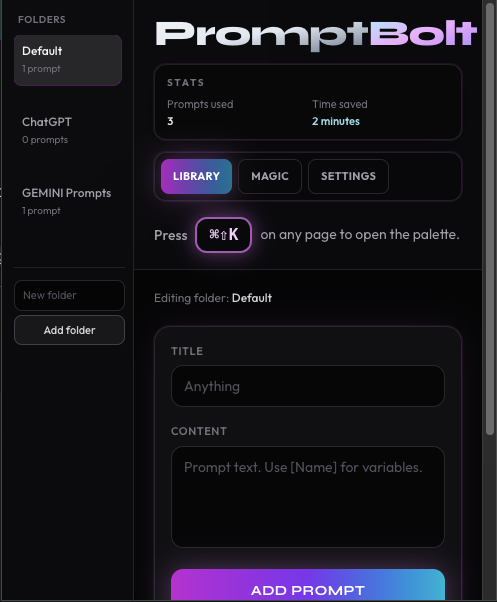
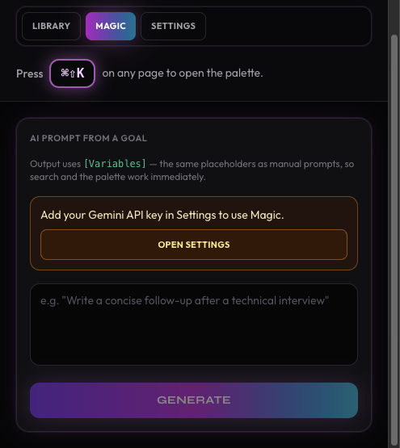
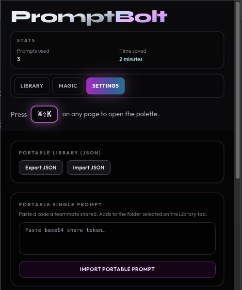
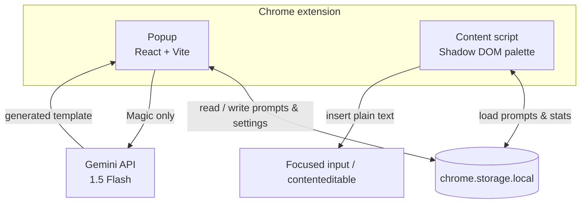

<div align="center">

# ⚡ PromptBolt

**Stop retyping the same prompts—open a Spotlight-style palette anywhere on the web and paste in one keystroke.**

<br />



<br />

</div>

---

## Project vision

**PromptBolt** is a Chrome extension built for **AI power users** who feel **prompt fatigue**: juggling dozens of saved snippets across notes apps, docs, and chat tabs. This gives you a **Spotlight-inspired command palette** (fuzzy search, keyboard-first) that works **on whatever page you’re on**—Gmail, ChatGPT, Gemini, LinkedIn, or anywhere you can type.

No context switching. No hunting through folders mid-conversation. One shortcut, your library, instant paste and continue working, saving thousands of hours over time.

---

## Feature showcases

### Smart search — the palette

Press **⌘ ⇧ K** (macOS) or **Ctrl + Shift + K** (Windows / Linux) to open the **PromptBolt palette**. **Fuzzy search** (via [Fuse.js](https://fuse.js.org/)) ranks prompts by relevance and **recency**, so your most-used templates float to the top. Folder filters and a live preview keep long prompt bodies scannable before you insert.

<div align="center">


</div>

---

### Magic AI — templates from a sentence

Describe what you need in plain language; **Magic** calls **Google Gemini 1.5 Flash** and returns a **reusable template** with clear **`[Variable]`** placeholders—ready for the same search and injection pipeline as hand-written prompts.

<div align="center">



</div>

Your **Gemini API key** is stored only in **`chrome.storage.local`** on your device—never shipped in the extension bundle.

---

### Dynamic variables — `[Square Brackets]`

Write prompts using **`[Name]`**, **`[Company]`**, **`[Topic]`**, or any label you need. When a prompt contains placeholders, the palette switches to a **variable step**: fill the fields, then insert—substitution runs before text hits the page, so the host app sees a single coherent string.

---

### Privacy & settings

**Libraries, folders, and usage stats** persist with the **Chrome Storage API** (`chrome.storage.local`). The **Settings** tab supports **JSON backup/restore**, portable prompt sharing, **Gemini key** management (password field), and a **site blacklist** so you can disable the palette on sensitive hosts (e.g. banking).

<div align="center">



</div>

---

## Technical deep dive

### Tech stack

| Layer | Choice |
|--------|--------|
| **UI** | [React 19](https://react.dev/), [TypeScript](https://www.typescriptlang.org/) |
| **Styling** | [Tailwind CSS](https://tailwindcss.com/) |
| **Build** | [Vite](https://vitejs.dev/) |
| **Search** | [Fuse.js](https://fuse.js.org/) (fuzzy matching in the palette) |
| **Extension** | Manifest V3, `chrome.storage`, content scripts |

### Architecture

- **Popup (`index.html` + React)** — Manage folders, prompts, Magic generation, backups, and blacklist rules.
- **Content script** — Injected on all URLs (including **iframes** where allowed) so shortcuts and paste targets work in compose surfaces like Gmail.
- **Shadow DOM** — The on-page palette mounts inside an **open shadow root** so PromptBolt’s glass UI and styles **don’t clash** with the host page’s CSS.
- **Chrome Storage API** — Prompts, selection, analytics, LLM settings, and blacklist are **persisted locally**; no account required.

### Flow (high level)



- **Popup** edits data and calls **Gemini** only for **Magic** when a key is saved.  
- **Content script** reads the same storage, renders the palette in **Shadow DOM**, and **injects** text into the focused field.  
- **Gemini** is optional; everyday palette use is fully local.

---

## Setup

### Prerequisites

- [Node.js](https://nodejs.org/) (LTS recommended)
- [Google Chrome](https://www.google.com/chrome/) (or another Chromium browser with MV3 support)

### Clone & install

```bash
git clone https://github.com/zareefzaman/PromptBolt.git
cd PromptBolt
npm install
```

### Build the extension

```bash
npm run build
```

This runs TypeScript (`tsc -b`) and Vite. Output is written to **`dist/`**—that folder is what Chrome loads.

### Load unpacked in Chrome

1. Open **`chrome://extensions`**
2. Enable **Developer mode** (top right)
3. Click **Load unpacked**
4. Select the **`dist`** directory inside the project (e.g. `…/PromptBolt/dist`)

After code changes, run `npm run build` again and use **Reload** on the extension card.

### Optional: icons

```bash
npm run icons
```

---

## Author

**Zareef Zaman**

- GitHub: [github.com/zareefzaman]([https://github.com/zareefzaman](https://github.com/Zareef09))  
- LinkedIn: [linkedin.com/in/zareefzaman]([https://www.linkedin.com/in/zareefzaman](https://www.linkedin.com/feed/))

---

<p align="center">
  <sub>Built with ⚡ for people who live in AI chat tabs.</sub>
</p>
